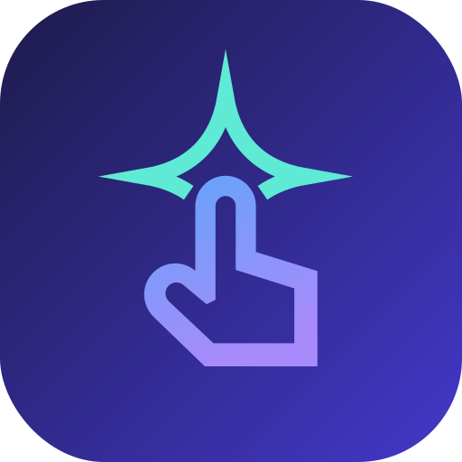

# Phase 4 — Product UI/UX: from functional to world-class

> Language note: English-first, per `CLAUDE.md`. This is a design doc — it
> captures direction and decisions ahead of implementation, the way
> `second-pair-of-hands.md` and `on-device-companion.md` did. No code lands with
> this doc; Phase 4 is built in its own series of PRs.

## Why now

The on-device agent is verified on real hardware — the product *works*. But the
UI was deliberately built as the thinnest possible surface (plain Android Views,
no androidx, no Material) to keep the agent's security-sensitive core small and
reviewable. That was the right call to get here; it is not the right place to
stay. The end vision is a production-ready Play Store app, and that needs a
deliberate UI/UX phase rather than ad-hoc polish bolted onto feature PRs.

## What makes this product's UX unusual

This is an AI that *operates the user's phone*. The hardest and most
differentiating UX problem is therefore **trust and control**: the user must
feel, at every moment, that they understand what the agent is doing and can stop
it instantly. Visual polish matters, but trust is the product. Every pillar
below is in service of that.

## Framework decision (recommended)

Adopt **Jetpack Compose + Material 3** for the **presentation layer only**
(onboarding, chat, settings, about, overlays' chrome). The **control surface** —
`AccessibilityService`, the loopback HTTP server, snapshot/action code, and the
agent loop — stays dependency-free and untouched.

This **refines, not discards**, the Phase-2 decision recorded in the runtime
plan ("zero-third-party-dependency Kotlin … no androidx"). That rule exists to
minimize the supply-chain and review surface of the *security-sensitive core*;
it was never a product-quality goal for the chrome. Splitting the app so the UI
module may use androidx/Compose while the control surface remains dependency-free
preserves the security rationale exactly where it matters and unblocks a
world-class UI everywhere else. Compose + Material 3 is the modern Android
standard (dynamic color, dark mode, motion, accessibility, foldable support come
largely for free).

## The six pillars

1. **Trust, control, safety** (the differentiator)
   - Always-visible **Stop**; the loop halts within one action (already true in
     logic — make it unmissable in UI).
   - Live "what is the agent doing right now" status: current narration,
     human-readable tool-call chips ("Reading the screen", "Tapping Settings"),
     a heartbeat/progress cue.
   - An "agent is in control" indicator and an informative **foreground-service
     notification** that doubles as a control surface (the agent's overlay/
     accessibility work needs a foreground service anyway).
   - Surface the already-shipped safety features as first-class: gesture trail,
     touch-to-pause, and a polished Material confirmation bottom sheet.

2. **Onboarding (chunk 4.1 — highest leverage)**
   - A guided first-run wizard: welcome → enable accessibility → API key → ready.
   - Step **detection + deep links** (jump straight to the right settings
     screen); detect Android 13+ and pre-empt the **restricted-settings** dialog
     with inline visual guidance; OEM-aware notes (Samsung/Xiaomi flows differ).
   - API-key step with rationale ("why we need this / where it goes — only
     api.anthropic.com") and validation feedback.
   - Verify each step is actually done before advancing; end with a first
     suggested task.

3. **Chat experience** (the primary surface)
   - Streaming that feels alive; optional thinking/reasoning display; tool-call
     chips; inline screenshots of what the agent sees; message grouping.
   - Empty state with suggested prompts ("Turn on Bluetooth", "Reply to my last
     text"); native-feeling push-to-talk and TTS toggles (already shipped).

4. **Design system & identity**
   - Material 3 / dynamic color, full dark mode, type + spacing tokens.
   - A real adaptive app icon — **shipped in PR-A**: the brand mark is the
     agent's hand tapping out an **AI sparkle** (the touch-gesture hand in a
     blue→violet gradient, with an open mint "sparkle crown" blooming above the
     fingertip — arms cut with gaps so it stays distinct from the hand, including
     in monochrome), in the brand "Aurora" palette (indigo gradient ground),
     with a monochrome layer for Android 13+ themed icons
     (`res/drawable/ic_launcher_foreground.xml` + `ic_launcher_monochrome.xml`,
     gradient `ic_launcher_background.xml`). The same palette drives the app
     theme (`ui/theme/`). Reference render:
     
   - Still to do: an Android 12+ splash screen, meaningful motion and haptics.

5. **Settings & privacy / transparency**
   - Model picker (ties to the models-API backlog item), confirmation and voice
     toggles, all clearly explained.
   - A transparency screen: what the app can see, what leaves the device (only
     to api.anthropic.com), how the key is stored (Keystore), and the kill
     switch always one tap away. Restyle the interim About sheet here.
   - **Shipped in 4.5** as `SettingsActivity` + `PrivacyActivity` (About kept
     separate for the licenses screen Play expects), a Material You toggle, and
     honest data controls (clear key / clear conversation / delete all). The
     "recent prompts for quick re-run" backlog item grew into **persistent,
     resumable multi-session conversations** — a named History list
     (`SessionStore`, text-only on disk; screenshots never persist) the user can
     revisit, resume (model history rebuilt from the transcript), rename,
     archive, delete, and export to Markdown.

6. **Accessibility, localization, responsive, Play readiness**
   - An accessibility app must itself be exemplary: screen-reader friendly,
     large-font / high-contrast safe, RTL-ready, localizable (revisits the
     zh-CN docs too).
   - Foldable / tablet / landscape layouts, edge-to-edge, predictive back,
     60fps, crash-free.
   - **Play Store readiness:** signed AAB, listing assets, a privacy policy, and
     a review of sensitive permissions (e.g. `QUERY_ALL_PACKAGES` is justified
     for sideload today but needs a Play declaration or a narrower approach).

## Suggested phasing

- **4.1** Onboarding wizard (the roughest new-user moment today).
- **4.2** Design-system foundation: Compose + Material 3, theme/dark mode, app
  icon, splash. Lands with or just before 4.1, since onboarding is built on it.
- **4.3** Chat experience polish.
- **4.4** Trust/control surface (notification, in-control indicator, Stop,
  confirmation sheet).
- **4.5** Settings & privacy/transparency.
- **4.6** Accessibility, localization, responsive layouts, Play-Store readiness.

## Definition of done (quality bar)

A first-time user can install, get through setup without confusion (including
the restricted-settings step), and run a task while always feeling in control;
the app looks and moves like a modern Material 3 app, is accessible and
localizable, runs jank-free on a phone and a foldable, and meets the Play Store
listing and policy bar — all without adding any dependency to the control
surface.

## Out of scope for this doc

Implementation. Each chunk gets its own execution plan under
`docs/exec-plans/active/` and its own PR(s).
